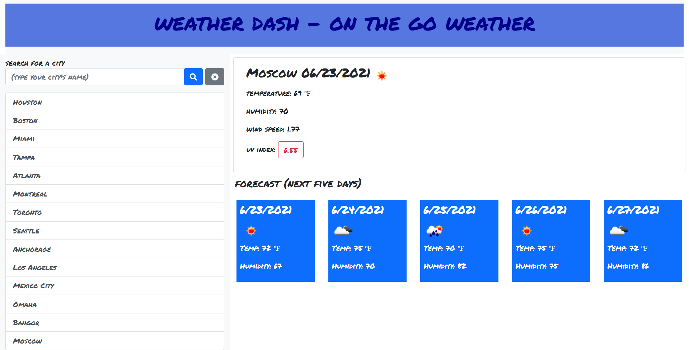

# quick-check weather on the run = weather dash (we don't have time for caps)

# Why, What and How is it? (Okay - maybe SOME caps.)

## Why?
As we have discussed in the past (see my other repos' ReadMe docs), life moves fast. We don't have time to wade through the barrage of information out there. We want things simple, easy and in as few clicks as possible.

Welcome to weather dash - so you know what's happening with the weather where you want to know it - Quickly.

## What?
This straightforward weather-retrieval app takes openweather api information and presents it to you in a streamlined and clean interface. Limited interaction lets you focus only on what's needed - your current (or, past-searched) city for a current perspective on life - including a UV index reading to help you prepare.

## How?
The little things matter. We show only your past 13 cities (we're not superstitious) so they all can fit on your laptop screen. We picked a font that makes caps/non-caps moot. We highlighted the UV Index data if it is too high (5 or more is too high and everywhere is too high so far this year). We grabbed the appropriate icons to speed your perception of the information. If the screen is too busy, you can make it neater by hitting the clear button to remove the saved cities.

## What else do I need to know?
Not a bunch. I originally was using Bulma for the .css framework but found it a bit more challenging than I wanted to lay out according to project requirements.

Here's the look and feel:

## Installation
Great news! Simply launch the page associated with the repo to view and use this code:

Repo:  https://github.com/dtmerrill/weather-dashboard

Deployed Page:  https://dtmerrill.github.io/weather-dashboard/

## Usage
Just (type your city's name) in the box in the upper left of the screen and hit the magnifying glass or select one of the saved cities to start your adventure.

## Credits
As always, we never walk completely alone.

## License
MIT License

Copyright (c) [2021] [Dana T Merrill]

Permission is hereby granted, free of charge, to any person obtaining a copy
of this software and associated documentation files (the "Software"), to deal
in the Software without restriction, including without limitation the rights
to use, copy, modify, merge, publish, distribute, sublicense, and/or sell
copies of the Software, and to permit persons to whom the Software is
furnished to do so, subject to the following conditions:

The above copyright notice and this permission notice shall be included in all
copies or substantial portions of the Software.

THE SOFTWARE IS PROVIDED "AS IS", WITHOUT WARRANTY OF ANY KIND, EXPRESS OR
IMPLIED, INCLUDING BUT NOT LIMITED TO THE WARRANTIES OF MERCHANTABILITY,
FITNESS FOR A PARTICULAR PURPOSE AND NONINFRINGEMENT. IN NO EVENT SHALL THE
AUTHORS OR COPYRIGHT HOLDERS BE LIABLE FOR ANY CLAIM, DAMAGES OR OTHER
LIABILITY, WHETHER IN AN ACTION OF CONTRACT, TORT OR OTHERWISE, ARISING FROM,
OUT OF OR IN CONNECTION WITH THE SOFTWARE OR THE USE OR OTHER DEALINGS IN THE
SOFTWARE.